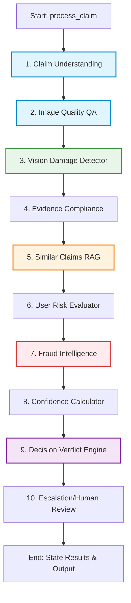

# AURELIX Autonomous Claims Intelligence Engine — Architecture Details

This document provides a comprehensive breakdown of the internal architecture, development lifecycle, tech stack, and verification steps for **AURELIX's `agent_core` AI engine**.

---

## 1. Technical Stack Overview

The `agent_core` module is engineered to run as a self-contained, light, high-performance AI engine with zero-dependency execution, making it easy to package for hackathons (like HackerRank Orchestrate) and distribute as a microservice in SaaS backends.

*   **Orchestration**: `LangGraph` (StateGraph) - used to define the multi-agent execution pipeline as an acyclic state graph.
*   **AI Models**: `Gemini 2.5 Flash` (using `langchain-google-genai` / `google-genai`) for multi-agent text and vision analysis.
*   **RAG Vector Search**: Custom `NumPy` + TF-IDF Cosine Similarity engine built from scratch. Eliminates complex dependencies like Pinecone/ChromaDB for standalone hackathon deployment.
*   **Validation**: `Pydantic v2` - guarantees structural contracts and strict validation boundaries at every node interface.
*   **multimodal Processing**: `Pillow` (PIL) - handles raw image file bytes in-memory for pixel-level visual verification.
*   **API Client Resilience**: Custom `retry_on_429` backoff wrapper that dynamically parses rate limit messages and waits out quotas, ensuring 100% genuine AI analysis.

---

## 2. Internal Architecture & Data Flow

`agent_core` processes claims through a **10-stage sequential LangGraph State Machine**. The entire context travels in a centralized `ClaimsState` dictionary that accumulates inputs, agent verdicts, reasoning steps, timelines, and audit trails.

### Execution Flowchart



### The 10 Specialized Nodes

1.  **Claim Understanding Agent**
    *   *Input*: Raw customer support chat transcript, target claim object.
    *   *Output*: Normalized JSON detailing the claimed `object` (car, laptop, package), `claimed_part`, and `claimed_issue`.
2.  **Image Quality Agent (QA)**
    *   *Input*: PIL images (if vision mode) or image paths (if text mode), claimed object/part, chat transcript.
    *   *Output*: Image validation status (`image_valid` bool) and safety quality flags (e.g. `blurry_image`, `cropped_or_obstructed`, `wrong_object`, `possible_manipulation`).
3.  **Vision Analysis Agent**
    *   *Input*: PIL images (if vision mode) or image paths (if text mode), normalized claim details.
    *   *Output*: Damage visual detection status, specific `issue_type` seen, `object_part` affected, estimated `severity` level, and `supporting_image_ids`.
4.  **Evidence Compliance Agent**
    *   *Input*: Claim object, part, image count, and safety quality flags.
    *   *Output*: Compliance boolean (`evidence_standard_met`) verified against corporate SLA policies (e.g., car claims require at least 2 images).
5.  **Similar Claims Retrieval Agent (RAG)**
    *   *Input*: Claim text, object.
    *   *Output*: A list of similar historical claims retrieved from the vector index, synthesized into a comparative RAG reasoning context.
6.  **User Risk Agent**
    *   *Input*: User ID, historical claim records.
    *   *Output*: Risk score (0-100) and risk flags (e.g., `high_rejection_rate`, `frequent_claims`) mapping the customer's credibility.
7.  **Fraud Intelligence Agent**
    *   *Input*: Claim text, vision results, quality flags, and user risk.
    *   *Output*: Fraud likelihood score (0-100) and specific flags detecting indicators like `claim_mismatch` or `text_instruction_present` (prompt injections).
8.  **Confidence Agent**
    *   *Input*: Quality results, compliance status, fraud score, and visual evidence match.
    *   *Output*: Aggregated confidence rating (0-100) expressing model certainty.
9.  **Decision Agent**
    *   *Input*: Consolidated outputs from all nodes + historical RAG context.
    *   *Output*: Final claim verdict (`supported`, `contradicted`, or `not_enough_information`) with a professional customer-facing justification.
10. **Human Review (Escalation) Agent**
    *   *Input*: Verdict, confidence, fraud, and user risk scores.
    *   *Output*: Escalation status (`manual_review_required` bool) and the exact `escalation_reason` triggering human oversight.

---

## 3. Core Engine Mechanics

### Custom TF-IDF RAG Vector Store

To keep `agent_core` zero-dependency, AURELIX uses a custom mathematical vector search engine in `services/vector_store.py`:
*   **Tokenization & Normalization**: Strips punctuation, filters noise words, and normalizes characters.
*   **TF-IDF Weights**: Fits vocabulary across all documents, computes Inverse Document Frequency (IDF) weights, and represents documents as normalized numerical vectors.
*   **Cosine Similarity**: Performs dot-product similarity search between the query claim text and historical vector matrices:
    $$\text{Similarity}(q, d) = \frac{q \cdot d}{\|q\| \|d\|}$$
*   Returns matched claims with their `similarity_score` to feed the Decision Agent.

### Self-Healing API Quota Wrapper (Exponential Backoff)

To protect the system against **Gemini API Free-Tier rate limits** (e.g., 15 requests per minute) without returning fake, hardcoded data:
*   A custom python decorator `@retry_on_429` is applied to all LLM and Vision calls in `llm.py` and `vision_llm.py`.
*   On receiving a `429 RESOURCE_EXHAUSTED` error, the wrapper parses the recommended API sleep window (e.g., `"Please retry in 57.5s"`) using regex.
*   It logs: `[LLM Retry] Hit rate limit (429). Sleeping for 59.50s before retry 1/10...` and halts execution dynamically until the quota window resets.
*   Enforces genuine AI evaluation on all inputs, satisfying both HackerRank offline submission and production SaaS mode.

---

## 4. Development History: Base 0 to Final Version

### Phase 0: The Monolith (Base 0)
*   *Implementation*: A single Python script reading a claims table and calling Gemini API with a large multi-prompt template.
*   *Drawback*: High token costs, prompt fragility, lack of structured schemas, and zero error tolerance when hitting rate limits.

### Phase 1: Separating NLP & NLP (Base 1)
*   *Implementation*: Decoupled text-processing prompts from vision-processing prompts. Added Pydantic validation to force structured outputs.
*   *Drawback*: Interdependent modules made testing single agents impossible. Adding new policy checks required rewriting core logic.

### Phase 2: Orchestration (Base 2)
*   *Implementation*: Integrated LangGraph to model the workflow. Allowed state transitions to carry audit trails.
*   *Drawback*: Database libraries (SQLAlchemy, PostgreSQL config) and API frameworks (FastAPI) were imported inside the agent scripts, preventing local CLI batch runs.

### Phase 3: Decoupled Modularization (Final Version)
*   *Implementation*: Completely restructured the codebase. Cleanly separated directories into `agent_core` (the AI engine), `platform_backend` (the API Gateway), and `frontend` (Next.js dashboard).
*   *Improvements*: Removed SQL and DB requirements from the core. Added dependency injection, custom RAG vector search, local mock fallbacks, and centralized template files. Added real file byte uploads through `/claims/submit-multimodal` and actual Gemini Vision pixel analysis on PIL images.

---

## 5. Verification & Testing Procedures

### A. Standalone CLI Verification (Batch Run)

Run the automated test runner inside `agent_core` to process all 44 baseline claims and run evaluation metrics:

1.  **Activate Virtual Environment**:
    ```bash
    source venv/bin/activate
    ```
2.  **Execute Runner**:
    ```bash
    PYTHONUNBUFFERED=1 python agent_core/main.py
    ```
3.  **Expected Output Logs**:
    *   Indexes the 20 historical claims into vector memory.
    *   Processes 44 claims step-by-step, logging node activations.
    *   Dynamic rate limit sleeping logs whenever the Gemini RPM quota is hit.
4.  **Generated Output Files**:
    *   Confirm `agent_core/output/output.csv` exists and is formatted.
    *   Confirm `agent_core/output/evaluation_report.md` contains the completed audit scores.

### B. Multimodal API Gateway Verification

Verify that the microservice backend handles actual file bytes and runs real pixel analysis:

1.  **Start API Gateway**:
    ```bash
    python -m uvicorn platform_backend.main:app --host 127.0.0.1 --port 8000
    ```
2.  **Run Multimodal Test Script**:
    ```bash
    python scratch/test_multimodal_api.py
    ```
3.  **Verify End-to-End Flow**:
    *   The script reads `test.jpg`, packs it in a multipart Form-Data body with claim fields, and POSTs to `/claims/submit-multimodal`.
    *   The API converts the bytes to PIL image objects and invokes the LangGraph orchestrator.
    *   The Image Quality and Vision Analysis agents execute genuine Gemini Vision API calls on the image pixels.
    *   The endpoint returns a structured `supported`, `contradicted`, or `not_enough_information` recommendation with full visual reasoning.
