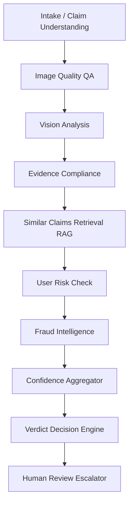

# AURELIX Agent Core - Standalone AI Claims Engine

This directory contains the self-contained AURELIX AI reasoning engine. It is designed to run independently from the production SaaS web server, providing a pure Python environment for batch claim analysis and HackerRank evaluation.

---

## 1. Directory Structure

```
agent_core/
├── main.py                      # CLI runner: parses CSVs -> runs agents -> generates output
├── requirements.txt             # Core Python package dependencies
├── data/                        # Static database of historical claims & rules
│   ├── claims.csv               # Input claims to process (44 rows)
│   ├── sample_claims.csv        # Ground truth validation case files (13 rows)
│   ├── user_history.csv         # Historic claims and rejections profile table
│   └── evidence_requirements.csv # Object SLA rules and visibility guidelines
├── output/                      # Generated results folder
│   ├── output.csv               # Claim verdicts (Hackathon output schema)
│   └── evaluation_report.md     # Classification metrics (F1, Precision, Recall)
├── agents/                      # Specialized agent modules
│   ├── claim_understanding.py   # Customer intent parsing
│   ├── image_quality.py         # Visual artifact checks (blur, obstructions)
│   ├── vision_analysis.py       # Main visual damage extraction
│   ├── evidence_compliance.py   # Policy compliance analysis
│   ├── similar_claims.py        # Vector similarity (RAG) agent
│   ├── user_risk.py             # User history risk score evaluation
│   ├── fraud_intelligence.py    # Claim/image mismatch & fraud checks
│   ├── confidence.py            # Aggregate confidence calculation
│   ├── decision.py              # Verdict assignment (supported/contradicted/no_info)
│   └── human_review.py          # Escalation logic
├── orchestrator/
│   └── graph.py                 # LangGraph graph configuration
├── prompts/
│   └── templates.py             # Centralized agent system prompt templates
├── schemas/
│   └── models.py                # Pydantic schemas for agent validation
└── services/
    ├── llm.py                   # Model client router (Gemini / OpenAI)
    └── vector_store.py          # TF-IDF RAG claims retriever
```

---

## 2. Setting Up the Environment

Install core dependencies in your virtual environment:
```bash
pip install -r requirements.txt
```

Set up your Gemini API key (or OpenAI key) in `.env` inside the project root:
```env
GEMINI_API_KEY=AQ.Ab8RN...   # Or use OPENAI_API_KEY
```

---

## 3. Running the Batch CLI

Process the claims batch and compute the system classification metrics:
```bash
python main.py
```

* **Expected Output**: 
  - Generates `output/output.csv` containing final verifications.
  - Generates `output/evaluation_report.md` comparing model decisions against the ground-truth set.

---

## 4. Coordinated Multi-Agent Pipeline

Claims are processed through a structured LangGraph topology of 9 specialized agents:


