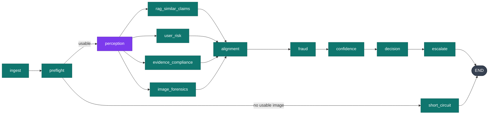

# AURELIX — Target Architecture

**Phase 1 deliverable. Design only; no code changes accompany this document.**

Status of the codebase this designs against: post-Phase-0.5 (`docs/PHASE_0.5_REPORT.md`).
The system runs, fails honestly, and has 74 tests holding the output contract in place.

---

## 0. Three premises in the brief that the measurements changed

Design work that starts from a wrong diagnosis produces confident, wasted effort. Three
things I was asked to fix turn out not to be the problem, or not to be the problem for the
stated reason.

**"Current design is a 10-node straight line — worst possible latency."**
It is 9 nodes, and it is already a DAG. More importantly, **the fan-out already executes
concurrently.** Measured against the installed LangGraph 1.2.6 — four branches each sleeping
1.0 s:

| mode | wall clock |
|---|---:|
| sync nodes + `.invoke()` | 1.01 s |
| async nodes + `.ainvoke()` | 1.00 s |

Sync node functions are dispatched to a thread pool. There is no fan-out win available,
because there is no fan-out loss. (My own Phase 0 audit claimed otherwise; it was wrong, and
§2.3 of `AUDIT.md` now carries the correction and the reasoning error.)

**"Parallelising the branches will cut latency."**
It will not, measurably. Of the four branches, three are deterministic Python costing 0–31 ms.
The critical path is the **serial chain of four LLM round trips**:

```
ingest 5.9s → vision 9.0s → fraud 5.5s → decision 6.9s   = 27.3s
```

The lever is *fewer sequential round trips*, not more concurrency. That reframes §1.3 of the
brief from "nice ~60% win" to "the entire latency strategy".

**"Split out microservices for scale."**
Rejected, with reasoning in §1. The brief already anticipated this and asked me to argue it
either way; I agree with the brief's own instinct.

One premise the measurements made *worse*: the free-tier quota is **20 requests/day**, not
just 5 RPM. At today's 4 calls/claim that is five claims per day. This is now the binding
constraint on the whole system and it drives §4.

---

## 1. Deployment shape

### Recommendation: modular monolith with async workers

```
┌─────────────┐   HTTP    ┌──────────────────┐   Redis    ┌──────────────┐
│  frontend   │──────────▶│ platform_backend │───queue───▶│    worker    │
│  (Next.js)  │◀──SSE─────│    (FastAPI)     │            │  (ARQ × N)   │
└─────────────┘           └──────────────────┘            └──────┬───────┘
                                   │                             │
                                   │      ┌──────────────────────┘
                                   ▼      ▼
                          ┌────────────────────────┐
                          │  postgres + pgvector   │
                          └────────────────────────┘
                                   ▲
                          ┌────────┴────────┐
                          │   agent_core    │  ← pure library, imported by
                          │  (no I/O, no    │    both backend and worker
                          │   DB, no print) │
                          └─────────────────┘
```

### Why not microservices

The proposal would be one HTTP service per agent. Against this system's actual numbers:

- **Latency moves the wrong way.** A local function call is ~0 ms. An in-cluster HTTP hop is
  1–5 ms plus serialisation. Splitting seven agents adds ~10–30 ms and buys nothing, against
  a 27,000 ms budget dominated by the model provider. We would add moving parts to shave 0.1%
  of the wrong thing.
- **The agents are not independently scalable.** They run once each, in a fixed order, per
  claim. There is no agent that needs 10× the replicas of its neighbour. The unit of
  concurrency is *the claim*, so the correct scaling unit is a worker that processes a whole
  claim — which is exactly the worker tier above.
- **The shared state is the graph state.** Agents communicate through one `ClaimsState`
  object. Across a network that becomes serialise/deserialise on every hop, plus a
  distributed-consistency problem where LangGraph currently gives us `InvalidUpdateError` for
  free.
- **Operational cost is real.** Seven services means seven deploys, seven health checks,
  seven sets of retry semantics, and distributed tracing as a prerequisite rather than a
  nicety — for a system whose entire reasoning core is 2,200 lines.

**Modularity is enforced by the module boundary, not the network boundary.** `agent_core`
stays import-clean and side-effect free; that is what makes an agent extractable later if
profiling ever justifies it.

### The one split worth pre-planning

**The vision/embedding path**, and only when profiling justifies it. It is the one component
with a genuinely different resource profile: large image payloads, potential GPU use for
local embedding models, and a much longer per-call latency. It stays in-process until one of
these is true:

1. embeddings move to a local model needing a GPU the API tier does not need;
2. image preprocessing (decode, downscale, pHash) exceeds ~20% of worker CPU;
3. vision throughput needs independent scaling from claim throughput.

None hold today. Designing the `Retriever` and vision interfaces cleanly (§3.4) is what keeps
that door open at near-zero cost.

### Queue: ARQ, not Celery

| | ARQ | Celery |
|---|---|---|
| Concurrency model | asyncio-native | sync-first; async is bolted on |
| Broker | Redis only | Redis/RabbitMQ/SQS |
| Dependencies | redis | kombu, billiard, vine, … |
| Fit for an async LLM client | direct | needs a thread bridge |

Our workload is IO-bound on HTTP calls to Gemini, and the Phase 2 client is `async`. ARQ
matches that without a sync/async bridge. Celery's extra brokers and routing features are
capability we would carry and not use. **If** the deployment target later mandates SQS or
RabbitMQ, revisit — that is the only realistic reason to switch.

---

## 2. Component boundaries

### `agent_core` — pure reasoning library

**Rule: no file reads, no DB, no network except the injected LLM client, no `print`.**
Everything I/O-shaped is injected. This is what makes the library testable without services
and reusable from both the API and the worker.

Current violations to remove in Phase 2:

| Violation | Location | Fix |
|---|---|---|
| Reads CSV from disk | `agents/user_risk.py:25-38`, `agents/policy_verification.py:31-44` | Caller injects the record; delete the fallback |
| `print()` throughout | `orchestrator/graph.py` (9 nodes) | `structlog` with an injected logger |
| Module-level compiled graph | `orchestrator/graph.py:397` | Factory function; caller owns the instance |
| Reads env directly | `services/gemini_client.py`, `services/config.py` | Settings object passed in at construction |

Public surface: `build_graph(deps) -> CompiledGraph`, `process_claim(...)`, the Pydantic
schemas, and `schemas/contract.py`. Nothing else is importable API.

### `platform_backend` — gateway

Owns auth, validation, persistence, queueing, and SSE. Does **not** own reasoning: it
enqueues and reports. Detailed API surface is Phase 5; the shape is
`POST /api/v1/claims → 202 + claim_id`, `GET /api/v1/claims/{id}`, and
`GET /api/v1/claims/{id}/stream`.

### `worker` — where scale comes from

Consumes the Redis queue, builds the graph once at startup, processes claims. Horizontally
scalable: `N` workers = `N` concurrent claims, bounded by the shared rate budget (§4.2). This
is the answer to "how do we scale", and it needs no service decomposition.

### `frontend` — Next.js

Exists today with a dashboard, submit tab, live investigation viewer, review queue, and
analytics tab. Phase 5 adds bounding-box overlay and reviewer override capture.

---

## 3. The graph

### 3.1 Target topology



**Purple = the only LLM call. Teal = deterministic Python. One model round trip per claim.**

### 3.2 What each node does and why it sits there

| Node | LLM | Purpose |
|---|:--:|---|
| `ingest` | — | Normalise input, assign ids, hash images |
| `preflight` | — | Decode, EXIF-strip, auto-orient, downscale to 1024px/q85, pHash, blur (OpenCV Laplacian variance), exposure. **Short-circuits to `not_enough_information` on zero usable images.** Built in Phase 0.5; Phase 2 adds the CV metrics |
| `perception` | **✓** | The single multimodal call — see §3.3 |
| `rag_similar_claims` | — | Hybrid retrieval, metadata-filtered (Phase 3) |
| `user_risk` | — | History scoring; already deterministic |
| `evidence_compliance` | — | Rule retrieval + check, cites `rule_id` |
| `image_forensics` | — | pHash near-duplicate lookup → `duplicate_image_reuse` (Phase 3.3) |
| `alignment` | — | Claimed-vs-observed comparison: `part_match`, `severity_delta`, `object_match`, `count_match` (Phase 4.3) |
| `fraud` | — | Scores the closed indicator set over alignment + forensics + risk |
| `confidence` | — | Documented weighted blend, calibration-checked (Phase 4.6) |
| `decision` | — | Ordered rule engine over `config/decision_rules.yaml`, each rule carrying a `rule_id` (Phase 4.4) |
| `escalate` | — | Review queue routing |

**Why `fraud`, `confidence`, and `decision` stop being LLM calls.** They are arithmetic and
threshold logic over structured fields. An LLM doing arithmetic is slow, expensive,
non-reproducible, and unauditable — and for an insurance verdict, "why was this rejected"
must have an answer better than "the model said so". Deterministic rules give a `rule_id` in
every justification and let thresholds be grid-searched (Phase 4.4) rather than guessed.

This is also what makes the front-bumper case from the brief §1 solvable *reliably* rather
than *usually*: `alignment` computes `part_match=mismatch` and `severity_delta=+2` as data,
and the decision matrix maps that to `contradicted` + `[part_mismatch, severity_inflation]`
every time.

### 3.3 The single perception call

Merge `claim_understanding` + `image_quality` + `vision_analysis` into **one** multimodal
request returning one structured object:

```python
class PerceptionOutput(BaseModel):
    claim: ClaimIntent          # object, claimed_part, claimed_issue, claimed_severity
    images: list[ImageFinding]  # per-image: quality + per-part damage findings
    injection_detected: bool
```

They remain **separate logical modules** operating on that one response, so the architecture
stays readable — `agents/claim_understanding.py` reads `response.claim`,
`agents/vision_analysis.py` reads `response.images`. Same seams, one round trip.

Enforced with native structured output: `response_mime_type="application/json"` plus
`response_schema=PerceptionOutput`. Already wired; Phase 0.5 added the `Literal` enums that
make it meaningful.

**Expected effect:** 4 sequential calls → 1. Critical path 27.3 s → ~9 s. Requests per claim
4 → 1, which quadruples free-tier throughput from 5 to 20 claims/day.

### 3.4 State design

Concurrent writes to one key without a reducer raise `InvalidUpdateError` — verified against
LangGraph 1.2.6. So disjointness is enforced by the framework, not by convention:

```python
class ClaimsState(TypedDict):
    # inputs — written once by ingest, read-only thereafter
    claim: ClaimInput
    # each parallel branch owns exactly one key
    perception: PerceptionOutput
    similar_claims: RetrievalResult
    user_risk: UserRiskOutput
    compliance: ComplianceOutput
    forensics: ForensicsOutput
    # append-only, reducer-merged
    audit_logs:     Annotated[list[AgentRun], operator.add]
    timeline:       Annotated[list[str], operator.add]
    pipeline_errors: Annotated[list[str], operator.add]
```

`pipeline_errors` is load-bearing, not diagnostic: non-empty means the verdict is degraded,
and the decision rules treat any failed branch as **unknown** — able to pull a verdict toward
`not_enough_information`, never able to support one.

---

## 4. Quota is the binding constraint

### 4.1 The arithmetic

Observed directly in live 429 bodies:

```
GenerateRequestsPerMinutePerProjectPerModel-FreeTier   = 5
GenerateRequestsPerDayPerProjectPerModel-FreeTier      = 20
```

| | calls/claim | free-tier claims/day | 44-claim batch |
|---|---:|---:|---|
| today | 4 | **5** | impossible |
| after §3.3 | 1 | **20** | still impossible |
| paid tier | 1 | ~10,000 | ~2 min |

**The 44-claim batch cannot run on free tier at any level of engineering quality.** The
brief's Phase 2 exit criterion — "zero 429s across a full 44-claim batch run" — is
arithmetically unreachable there. Either billing gets enabled, or that criterion is rewritten
around a 20-claim/day budget. This is a decision I need from you, not one I can engineer past.

Quota is also **per-project, not per-key**: rotating the key does not reset it.

### 4.2 Rate governance

Phase 0.5 shipped a process-local sliding-window governor enforcing RPM, TPM, and RPD, which
refuses immediately on daily exhaustion rather than blocking on a 24-hour window.

Phase 2 backs it with a **Redis Lua token bucket** so `N` workers share one budget. Without
that, 4 workers × 5 RPM each believe they own the quota and collectively produce 20 RPM
against a 5 RPM ceiling — the multi-process version of the exact bug Phase 0.5 fixed
in-process.

### 4.3 Caching

| Layer | Key | Effect |
|---|---|---|
| Result | `sha256(normalised_text + sorted_image_hashes + prompt_version + model)` | Re-runs cost zero calls; Phase 2 exit criterion "second run < 5 s" |
| Context | Gemini context caching for the system prompt, few-shot examples, rulebook | Cuts input tokens per call; these are identical every time |
| Embedding | content hash | Historical claims embedded once at index build |

Phase 0.5 already fixed the key (added `prompt_version` + `model`) and the image hash (was
hashing only the first 4 KB of pixels — the top few scanlines — so photos sharing a sky
collided). Remaining work is moving from per-agent keys to one per-claim key, which becomes
natural once there is one call.

### 4.4 Model routing

| Task | Route |
|---|---|
| Multimodal damage extraction | `gemini-2.5-flash` |
| Short text normalisation | `gemini-2.5-flash-lite` |
| Arithmetic, thresholds, policy mapping | **pure Python** |

`--model-profile {fast,balanced,accurate}` selects a block in `config/limits.yaml`.

---

## 5. Retrieval (Phase 3 summary)

One `Retriever` interface, two backends behind it:

- **pgvector + HNSW** for the deployed stack (Postgres is already in the compose file).
- **hnswlib flat-file** for CLI/offline, so the sandbox needs no services.

Hybrid: dense (`gemini-embedding-001`) + sparse (BM25 via `rank_bm25`), fused with Reciprocal
Rank Fusion, then reranked on metadata affinity. **Metadata filtering is mandatory before
similarity** — retrieving laptop claims to score a car claim is a correctness bug, not a
relevance one, and today's TF-IDF store has no filter at all.

Three collections: `historical_claims`, `policy_rules` (chunked, each carrying a stable
`rule_id` the compliance agent cites), `fraud_patterns`.

Index built offline via `python -m agent_core.tools.build_index`, versioned, **loaded once at
process start**.

---

## 6. Failure semantics

Already implemented in Phase 0.5 and load-bearing for everything above:

| Condition | Result |
|---|---|
| No usable image | Short-circuit → `not_enough_information` + reason, **zero LLM calls** |
| LLM unavailable | `LLMUnavailableError` → `not_enough_information`, confidence 0, review-flagged, real error attached |
| Branch failure | `BranchFailureOutput` → treated as *unknown*, never as *pass* |
| Claimed part not visible | `not_enough_information`, **never** `contradicted` |
| Daily quota exhausted | Immediate refusal, not a 24-hour block |

The invariant: **the system never asserts more than the evidence supports, and never invents
a verdict.** Absence of evidence is representable and distinct from evidence of absence.

---

## 7. Deployment

One `docker-compose.yml` brings up five services: `api`, `worker`, `redis`,
`postgres+pgvector`, `frontend`. Each component gets its own Dockerfile. Nothing exists today
— the root README documents a `docker run` for a Dockerfile that was never written (corrected
in Phase 0.5). This is Phase 5 work.

---

## 8. Migration path

| Phase | Delivers | Gated on |
|---|---|---|
| **2** | Async client, Redis token bucket, single perception call, image preprocessing, batch runner | Tier decision (§4.1) |
| **3** | pgvector + BM25 + RRF, three collections, pHash forensics | — |
| **4** | Part ontology, alignment engine, `decision_rules.yaml`, calibration | **Images** (§9) |
| **5** | API v1, Alembic, auth, observability, frontend evidence viewer | — |
| **6** | Recorded-fixture tests, golden adversarial suite, eval diffing, CI | — |

Ordering note: Phase 4 is where accuracy actually improves, and it is the phase most blocked
by missing data. If the images arrive, I would reorder 4 before 3 — retrieval quality matters
less than being able to see the damage at all.

---

## 9. Open decisions

1. **Where are the claim images?** Unresolved since Phase 0 and now blocking Phase 4. All 64
   input rows reference `images/test/` and `images/sample/`, which exist nowhere in the repo
   or its history. My 4 fixture photographs are a smoke test, not a dataset.
2. **Free or paid tier?** §4.1. Determines whether Phase 2's exit criteria are achievable as
   written.
3. **Severity vocabulary.** I am proceeding on `sample_claims.csv` winning
   (`none|low|medium|unknown`), since that is what gets scored. The brief proposes
   `none|minor|moderate|severe|total_loss`. If the grader changes, `contract.py` and one test
   change with it.
4. **Delete `submission_package/`?** 2,289 lines of tracked dead fork. Its images are already
   preserved in `tests/fixtures/`. Awaiting your go-ahead since it is destructive.

---

## 10. Summary of what changes and why

| Change | Reason | Expected effect |
|---|---|---|
| 4 LLM calls → 1 | Serial round trips are the entire critical path | 27.3 s → ~9 s; 4× quota headroom |
| `fraud`/`confidence`/`decision` → deterministic | Auditability and reproducibility; arithmetic is not a model's job | `rule_id` in every justification; grid-searchable thresholds |
| New `alignment` node | Claimed-vs-observed must be data, not vibes | Makes the front-bumper case reliable, not lucky |
| Redis token bucket | N workers currently each assume the full quota | No 429 stampede on scale-out |
| Modular monolith + ARQ workers | Scale unit is the claim, not the agent | Horizontal scale without 7 deploys |
| Image preprocessing | Token spend and upload time | Lower cost per claim, no accuracy loss |
| **Not** parallelising the fan-out | It is already concurrent (measured) | Avoids work that would have bought nothing |
