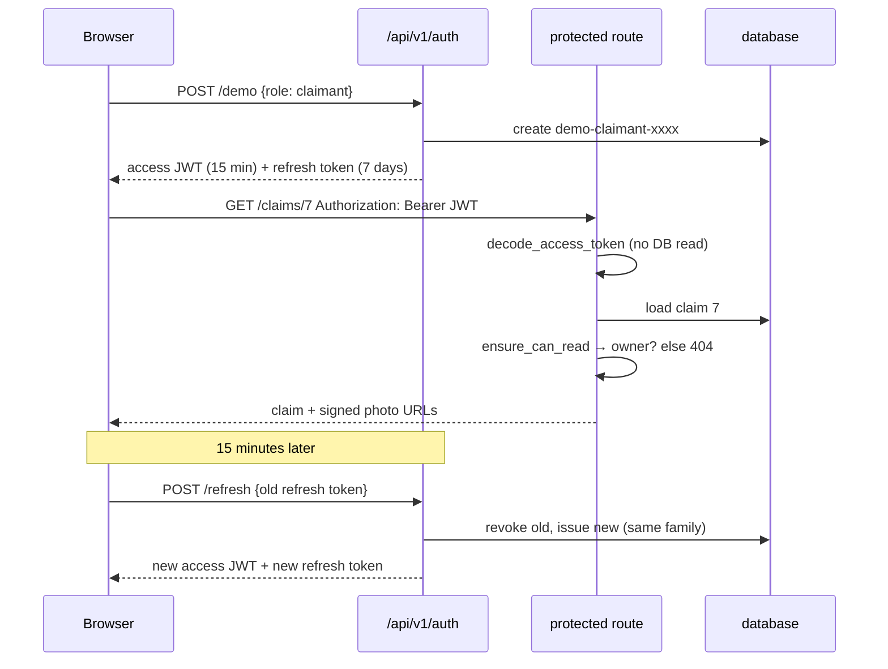

# Authentication and access control, in plain English

**Files:** `platform_backend/services/auth.py`, `platform_backend/security.py`,
`platform_backend/api/auth.py`, `platform_backend/services/rate_limit.py`,
`platform_backend/db/models.py` (`User`, `RefreshToken`), `frontend/lib/auth.ts`,
`frontend/components/auth/SignIn.tsx`, `docs/SECURITY.md`.

## The analogy

A hotel.

- **Checking in** (signing in) gets you two things. A **room key card** that opens doors but
  stops working after 15 minutes — that is the *access token*. And a **receipt** you can show at
  the front desk to get a fresh key card — that is the *refresh token*.
- **Every door checks the key card**, not the front desk. Fast, but a key card cannot be
  cancelled early — which is why it expires so soon.
- **The front desk takes your old receipt** every time it gives you a new card, and writes down
  that it did. If someone ever shows up with a receipt that was already handed in, the desk
  knows a copy exists, and cancels *every* receipt from that stay. That is *rotation with reuse
  detection*.
- **Guests only get into their own room** (claimants see their own claims); **staff** (reviewers)
  can enter every room and use the back office.
- **Photographs are behind a door with no card reader** (an `` tag cannot send a token), so
  the front desk hands out a **printed pass for one room that expires in 15 minutes** — a
  *signed URL*.

## One real request, traced

A visitor clicks **Explore as a claimant**, submits a claim, then opens it.

1. `SignIn.tsx` calls `signInDemo("claimant")` (`frontend/lib/auth.ts`) →
   `POST /api/v1/auth/demo`.
2. `api/auth.py::demo_login` checks the per-address limit (`rate_limit.enforce`), then
   `auth.create_demo_user` makes `demo-claimant-34f2571c` — a fresh account for this visitor,
   with no password.
3. `_tokens` returns an access token from `auth.issue_access_token` (a JWT: user id, username,
   role, `typ: access`, expiry in 15 minutes, signed HS256) and a refresh token from
   `auth.issue_refresh_token` (32 random bytes; the database stores only its SHA-256).
4. The browser keeps the access token in memory and the refresh token in `localStorage`.
5. The wizard submits. `api.ts::call` adds `Authorization: Bearer <access token>`.
6. On the server, `security.current_principal` decodes the token with `auth.decode_access_token`:
   signature, expiry, issuer, type and role all checked, algorithm pinned to HS256. No database
   read — the token itself is the proof.
7. `routes.submit_claim_multimodal_stream` calls `security.submitter_id`, which ignores the form's
   `user_id` for a claimant: the claim is saved under `demo-claimant-34f2571c`.
8. Opening the claim: `routes.get_claim` loads it and calls `security.ensure_can_read`. Another
   claimant would get a **404**. The owner gets `claim_detail(claim)`, which includes
   `asset_urls`: each photo path signed by `security.sign_asset` with an expiry.
9. The `` loads `uploads/<file>?exp=…&sig=…`; `main.get_upload` calls `verify_asset`, which
   recomputes the HMAC and compares it in constant time.
10. Fifteen minutes later the access token expires. `call` gets a 401, `refreshSession` posts the
    refresh token, `auth.rotate_refresh_token` revokes it and issues a new pair, and the request
    is retried — the visitor notices nothing.

## Diagram

## The rules worth remembering

- **401 vs 403 vs 404.** 401: we don't know who you are. 403: we know, and your role can't do this.
  404 for someone else's claim: we won't even confirm it exists.
- **Never trust the form.** `user_id` from a claimant is ignored; the token says who they are.
- **Pin the algorithm.** Accepting whatever algorithm a token names is how `alg: none` forgeries pass.
- **Hash what you store.** Passwords with Argon2id (memory-hard, so guessing is expensive);
  refresh tokens with SHA-256 (they are already random, so a fast hash is enough).
- **Same answer for every sign-in failure,** and a dummy hash for unknown usernames, so neither the
  message nor the timing reveals which accounts exist.
- **Tests use real tokens.** `tests/auth_helpers.py` mints them with the same function the login
  uses — there is no "skip auth in tests" switch that could be left on in production.

## Questions you might be asked

- *Why JWT and not server sessions?* A protected request then needs no database read. The cost is
  that a JWT can't be revoked early — hence 15 minutes plus a revocable refresh token.
- *Why not an httpOnly cookie?* It's the better design, but the frontend and API are different
  sites, where browsers increasingly block such cookies. With the API on `api.aurelix.space` it
  becomes possible. `docs/SECURITY.md` lists it as weakness #1.
- *What happens if a refresh token is stolen?* Whoever uses it first rotates it; when the other
  holder uses the old one, the server sees a reuse and revokes the whole family. Both must sign
  in again — the theft is contained to one rotation.
- *Why 19 MiB for Argon2?* OWASP's published minimum. The library default is 64 MiB per hash,
  which a 512 MB server can't afford at login time.
