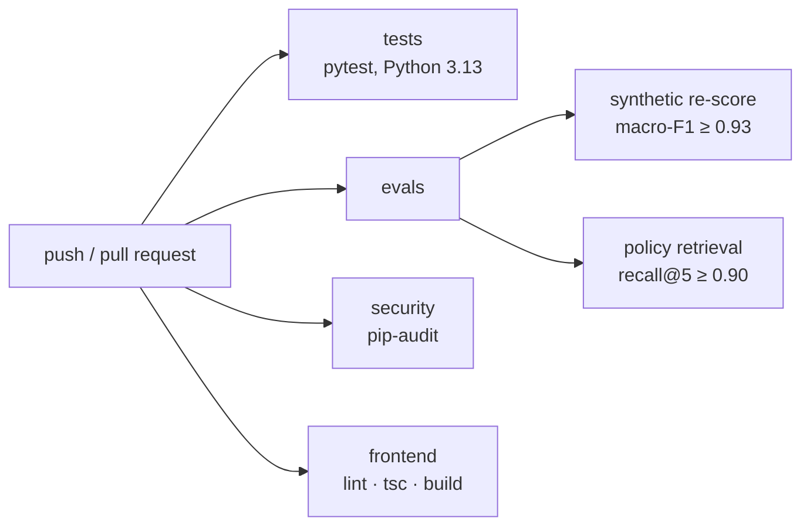

# Evaluation and CI, in plain English

**Files:** `agent_core/evaluation/evaluate_synthetic.py`, `agent_core/evaluation/evaluate_rag.py`,
`agent_core/evaluation/evaluate_copilot.py`, `evaluation/rag/golden.jsonl`,
`.github/workflows/ci.yml`, `requirements-dev.txt`.

## The analogy

A restaurant kitchen with three kinds of check.

- **The recipe test** (unit tests): does each step still do what it says? Fast, every time.
- **The tasting panel** (offline evaluations): a fixed menu of dishes with known right answers
  — 44 claims, 40 policy questions — scored the same way every time. If today's batch scores
  noticeably worse than the last, nothing leaves the kitchen.
- **The health inspector** (dependency audit): is any ingredient on a recall list?
- **The margin of error** (bootstrap interval): the panel only tasted 44 dishes. A score of
  95.5% on 44 could easily have been 89% on another 44 like them — so the report says so.

## One real run, traced

You push to `main`. GitHub runs `.github/workflows/ci.yml`, four jobs in parallel:

1. **`tests`** installs `requirements.txt`, `requirements-dev.txt` and the optional Anthropic
   SDK on Python 3.13 (what Render runs) and runs `pytest`. No job has a secret, so no test can
   spend model quota even by mistake; `tests/conftest.py` also points the quota ledger, the
   image index, the upload folder and the embedding backend at throwaway or offline versions.
2. **`evals`**:
   - `evaluate_synthetic --min-macro-f1 0.93` re-derives nothing new and calls nothing: it
     scores the stored verdicts in `agent_core/output/results_detail.json` against
     `ground_truth.csv`. `score()` computes accuracy and macro-F1; `bootstrap_ci()` resamples
     the 44 cases 10,000 times (seed 7) and reads the 2.5th and 97.5th percentiles. If macro-F1
     is under 0.93 — more than two points below the measured 0.950 — it exits 1 and CI fails.
   - `evaluate_rag --no-memory --no-report --min-recall5 0.90` downloads the 67 MB embedding
     model (cached between runs), builds the retriever over the 35 policy clauses and scores the
     40 golden questions. If the shipped configuration's recall@5 drops below 0.90 (measured
     0.961), CI fails.
3. **`security`** runs `pip-audit -r requirements.txt`. It found one real issue during Phase 7:
   `pydantic-settings 2.14.1` (CVE-2026-58203, symlink traversal in a secrets source AURELIX does
   not use). Upgraded to 2.14.2 anyway, because an unfixed CVE should not be a standing red mark.
4. **`frontend`** runs `npm ci`, `eslint`, `tsc --noEmit` and `next build`.

## Diagram

## The rules worth remembering

- **Gates are floors with headroom, not the measured value.** A floor at exactly 0.950 would fail
  on noise; 0.93 fails only on a real regression of more than two points.
- **An interval is honest about sample size.** 95.5% accuracy with a 95% interval of 88.6–100%
  says "good on these cases, and 44 cases cannot say more precisely than that".
- **Offline first.** Both gates re-score stored outputs or run local models: zero API calls, so
  CI can run on every push without touching the demo's budget. The live copilot evaluation
  (`evaluate_copilot --live`) is run by hand and refuses to run without the flag.
- **Same metric everywhere.** `score()` is what the headline uses and what every bootstrap
  resample uses; the code asserts the two agree.

## Questions you might be asked

- *Why bootstrap and not a formula?* Macro-F1 has no simple standard error; resampling works for
  any metric and is easy to explain.
- *Does the interval cover real-world accuracy?* No. It describes variation between sets of
  synthetic cases like these. Real photographs are a different distribution.
- *Why doesn't CI call the model?* Free-tier budgets are shared with the live demo, and a test
  that depends on a network call fails for reasons that have nothing to do with the change.
