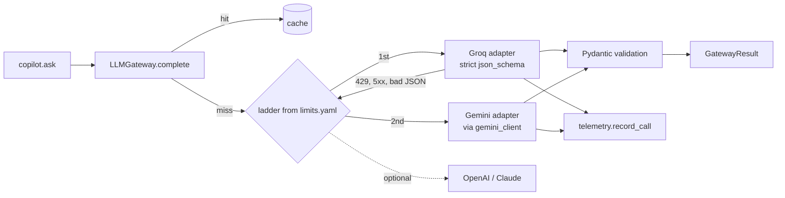

# The LLM gateway, in plain English

**Files:** `agent_core/llm/gateway.py`, `agent_core/llm/adapters/*.py`, `agent_core/llm/errors.py`,
`agent_core/llm/schema.py`, `config/limits.yaml` (`text_tasks`, `text_providers`).

## The analogy

Think of a hotel concierge. You say "I need a taxi to the airport". You don't care which taxi
company comes — the concierge has a list of companies in order of preference, phones the
first, and if they are busy phones the next. You get one answer back: "a car is coming,
here's the plate number, it costs this much".

- **You** are the copilot (or any feature that needs a text answer).
- **The concierge** is `LLMGateway`.
- **The list of taxi companies** is the *ladder* for a task in `config/limits.yaml`.
- **Each taxi company's phone etiquette** is an *adapter*: Groq, Gemini, OpenAI and Claude
  all want to be asked differently, and each adapter knows one of them.
- **"It costs this much"** is the telemetry record every call produces.

## Why it exists

Before Phase 7 the only model call was perception, written directly against Gemini. A
second kind of call — "answer a question about the policy" — could be served by several
providers. Writing the copilot against one vendor's SDK would bake a cost and availability
decision into feature code. The gateway keeps that decision in a YAML file.

## One real request, traced

The reviewer asks *"Is rust covered?"*. After retrieval (see `policy-rag-copilot.md`), the
copilot calls:

```python
gateway.complete("copilot_answer", messages, CopilotAnswer)
```

1. **`LLMGateway.complete`** (`gateway.py`) looks up the task `copilot_answer` in
   `config/limits.yaml`: prompt version `copilot-v1`, at most 700 output tokens, and the ladder
   `groq/openai/gpt-oss-20b` then `gemini/gemini-2.5-flash-lite`.
2. It opens `telemetry.call_context(task="copilot_answer", prompt_version="copilot-v1")`, so
   every record emitted inside is labelled with what the call was *for*.
3. **Cache check.** `_cache_key` hashes the task, prompt version, ladder, schema name and the
   exact messages. If `gemini_client._cache_get(key)` has an answer, it is returned with
   `cache_hit=True` and **no model is called**.
4. **First rung: Groq.** `OpenAICompatibleAdapter.available()` checks `GROQ_API_KEY` is set.
   `complete()` builds a request with
   `response_format={"type": "json_schema", "json_schema": {"strict": True, "schema": ...}}`.
   The schema comes from `strict_json_schema(CopilotAnswer)` (`schema.py`), which closes
   every object and marks every field required — what strict mode demands.
5. Groq answers. The adapter checks `finish_reason` (a truncated answer is broken, not
   short), checks for a refusal, then **validates the JSON with Pydantic**
   (`CopilotAnswer.model_validate_json`). The provider promised the schema; we check anyway.
6. The adapter calls `telemetry.record_call(...)` with tokens, latency and outcome `ok`.
7. Back in the gateway, `telemetry.collect()` captured that record, so the gateway builds a
   `GatewayResult` with the parsed answer, provider, model, tokens, latency and cost, and
   stores the answer in the cache.

**If Groq had said "slow down" (HTTP 429)**, the adapter would raise `RateLimited` (from
`errors.py`), the gateway would note the attempt and try Gemini next. If Gemini were also out
of quota, `complete` raises `DailyQuotaExhausted`, and the copilot shows "no answer model
available" instead of guessing.

## Diagram



## The rules worth remembering

- **One error vocabulary.** Every SDK's exceptions become one of five classes:
  `RateLimited`, `DailyQuotaExhausted`, `AuthError`, `ProviderUnavailable`,
  `InvalidResponse`. They all extend the old `LLMUnavailableError`, so existing
  `except LLMUnavailableError` code still catches everything.
- **The ladder is the retry policy.** On a free tier, retrying the same exhausted provider
  only spends the next request too. SDK retries are switched off (`max_retries=0`).
- **Perception's budget is off limits.** `GeminiAdapter` refuses any model on perception's
  ladder (`models.chain`), so a reviewer's questions can never make a claim's analysis fail
  for lack of quota.
- **Never a mock answer.** No rung answered → an error the caller must handle. Nothing in
  the gateway invents a reply.

## Questions you might be asked

- *Why not LangChain?* It would add a large dependency to do what ~200 lines here do, and
  hide the parts worth showing: error mapping, the ladder, cost accounting.
- *Why Groq first?* Measured free limits: 1,000 requests/day for `gpt-oss-20b` versus 20 for
  a Gemini model, and a budget the claim pipeline does not share.
- *What is the weak spot?* Groq's free tier allows only 8,000 tokens a minute, about seven
  copilot questions a minute. Beyond that the ladder falls to Gemini (20 a day), then fails
  honestly.
