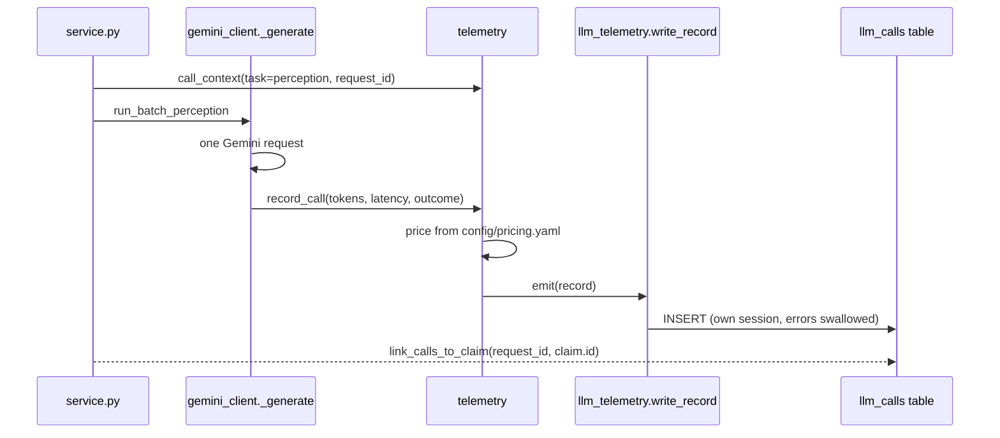

# Call telemetry and cost tracking, in plain English

**Files:** `agent_core/llm/telemetry.py`, `agent_core/llm/pricing.py`, `config/pricing.yaml`,
`platform_backend/services/llm_telemetry.py`, `platform_backend/db/models.py` (`LLMCall`),
`GET /api/v1/metrics/llm`, `frontend/components/dashboard/ModelUsageCard.tsx`.

## The analogy

A taxi meter. It doesn't drive the car and it doesn't choose the route — it only records
distance, time and fare for every trip, and at the end of the month you can see how many
trips you took and what each cost. If the meter breaks, the taxi still drives.

- **Each trip** is one model request (or one answer served from cache).
- **The meter reading** is a `CallRecord`: provider, model, task, tokens, latency, cost, outcome.
- **The monthly statement** is `GET /api/v1/metrics/llm`.
- **"The taxi still drives"** is the rule that telemetry can never fail a claim.

## One real request, traced

A claimant submits a car photo through the web form.

1. `claim_service.generate_claim_stream` makes a `request_id` (a random hex string) and passes it
   to `agent_core.service.analyse_claim_events`.
2. Around the perception call, `service.py` opens
   `telemetry.call_context(task="perception", request_id=..., prompt_version=PERCEPTION_PROMPT_VERSION)`.
   The prompt version is `perception@<8 hex chars>`: a hash of the prompt text, so it changes
   automatically if anyone edits the prompt.
3. `gemini_client._generate` makes the one request. Right after Gemini answers, `_emit_attempt`
   reads `response.usage_metadata` — input tokens, output tokens **plus thinking tokens**
   (Gemini bills thinking as output) — and calls `telemetry.record_call`.
4. `record_call` reads the labels from the context, prices the call with
   `pricing.cost_usd("gemini", "gemini-3.6-flash", in, out)` from `config/pricing.yaml`, and calls
   `emit(record)`.
5. `emit` hands the record to every *listener*. The web app subscribed one at startup:
   `llm_telemetry.write_record`, which inserts a row into the `llm_calls` table using **its own
   database session**, and swallows its own errors.
6. The claim row is saved. Then `link_calls_to_claim(db, request_id, claim.id)` fills in
   `claim_id` on that `llm_calls` row. It had to wait: the model call happens before the claim
   row exists.
7. Later, `GET /api/v1/metrics/llm` → `llm_telemetry.summarise` reads the rows and computes
   p50/p95 latency (nearest-rank percentile), cost per claim (sum of linked costs ÷ number of
   claims), cache-hit rate, and today's quota from the same ledger the client uses.

## Diagram

## The rules worth remembering

- **Counts and labels only.** No prompt text, no answer, nothing a claimant wrote. A test checks
  the table has no column that could hold it.
- **List price, not billed price.** Every provider here is on a free tier, so the bill is $0.
  The recorded cost is what the same traffic would cost on a paid tier, from a price file with
  a source and a date. An unlisted model is priced `null`, never `0`.
- **The code that makes the call emits the record.** Gemini's client for Gemini calls, each
  adapter for its own provider. One record per real request, no double counting.
- **Telemetry never fails a claim.** A listener that throws is logged and ignored; the link
  step after saving catches its own errors. A test subscribes a listener that raises and
  checks the verdict is unchanged.

## Questions you might be asked

- *Why not Prometheus or OpenTelemetry?* The question here is cost and quota per claim, which
  needs rows you can join to claims. A metrics backend is the next step at scale; the
  `subscribe` hook is where an exporter would attach.
- *Why nearest-rank percentiles?* They are exact, easy to explain, and return a latency that
  actually happened rather than an interpolated one.
- *How do you know the cache works?* `test_a_cached_perception_makes_zero_model_calls` runs the
  real client twice on the same claim and checks the fake network was called once and the
  quota ledger moved by one.
