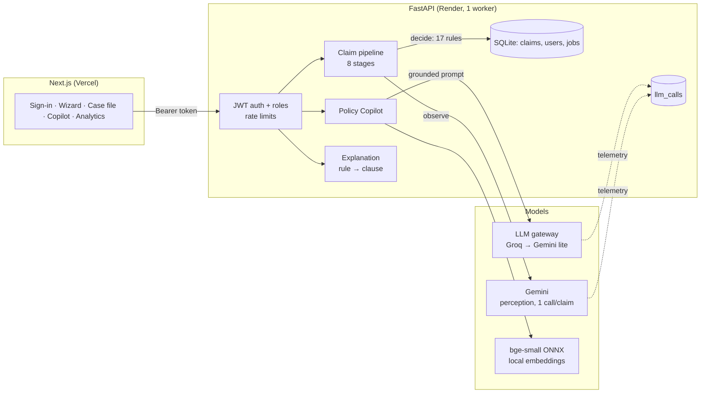

# AURELIX — Pitch

## 30 seconds

> AURELIX checks insurance damage claims. A customer uploads photos and describes what
> happened; one Gemini call **observes** what's in the photos, and **deterministic rules
> decide** whether the evidence supports the claim — every verdict names the rule that fired.
> Reviewers get a **RAG copilot** that answers policy questions with citations it can't fake,
> and a human approves the edge cases. It's secured with role-based access, gated by offline
> evaluations in CI, and every model call is cost-tracked — all on free tiers. It's live at
> aurelix.space.

## 2-minute walkthrough (demo order)

1. **Sign in as a claimant** (one click; a private account for this visitor). Submit a car claim:
   a statement and a photo. Watch the 8-stage trace — only one stage, *perception*, calls a
   model. *"Everything after that is Python: alignment, fraud score, confidence, 17 ordered
   rules."*
2. **The verdict.** "Supported — R052", with the photo that proves it. Open **Policy basis**:
   the clauses behind R052, from a deterministic map — no model involved. *"The claimant has a
   right to an explanation, and it's reproducible."*
3. **Sign out, sign in as a reviewer.** The claimant couldn't see this: every claim, the review
   queue, analytics. *"Roles are enforced on the server per route; another claimant's claim
   is a 404."*
4. **Ask the Policy Copilot** "Is rust covered?" → "No — wear and tear is excluded", citing
   **EXC-2**; expand the clause. Then ask "What's the monthly premium?" → **"Not in the
   policy. No model was called."** *"Hybrid retrieval — BM25 plus local embeddings — a gate
   that refuses with zero calls, and a validator that only shows clauses we retrieved."*
5. **Analytics → Model usage.** Calls, p50/p95 latency, cost per claim at list price, cache-hit
   rate, today's Gemini quota per model. *"Billed cost is zero — free tiers — but I track what
   it would cost at volume."*
6. **The repo.** Green CI: tests, a macro-F1 floor, a retrieval recall floor, a dependency audit.
   `docs/SECURITY.md` maps the OWASP LLM Top 10 to the tests that prove each control.

## Architecture

## The 12 numbers to know

| # | Number | What it is | Command |
|---|---|---|---|
| 1 | **1** | model request per claim | `pytest tests/test_llm_telemetry.py` |
| 2 | **17** | ordered decision rules, each mapped to policy clauses | `config/decision_rules.yaml`, `tests/test_policy_corpus.py` |
| 3 | **95.5%** | accuracy on 44 synthetic claims (95% CI 88.6–100%) | `python -m agent_core.evaluation.evaluate_synthetic` |
| 4 | **95.0%** | macro-F1 on the same (95% CI 86.0–100%) | same |
| 5 | **0.961** | copilot retrieval recall@5 (was 0.818 with LSA) | `python -m agent_core.evaluation.evaluate_rag` |
| 6 | **0.889** | copilot nDCG@5 (was 0.687) | same |
| 7 | **32/32 · 8/8** | live copilot: answerable cited correctly · unanswerable refused | `python -m agent_core.evaluation.evaluate_copilot --live` |
| 8 | **5** | of those 8 refused with zero model calls (the gate) | same |
| 9 | **287 MB** | API memory with the embedding model (512 MB limit) | `evaluate_rag` serving probe |
| 10 | **546** | tests passing (1 skipped: pgvector needs Postgres) | `python -m pytest`; CI run 37202181086 |
| 11 | **20 / day** | Gemini free requests per model (60/day across 3); Groq: 1,000/day, 8,000 tokens/min | `config/limits.yaml` |
| 12 | **15 min · 7 days** | access token · refresh token lifetime (rotated, reuse-detected) | `platform_backend/services/auth.py` |

## Limitations to volunteer (before they're found)

1. **The 44 benchmark cases are synthetic renders.** The accuracy says nothing about real photos —
   no lighting, reflections or motion blur.
2. **The copilot's golden questions and the policy share an author**, and the gate threshold was
   tuned on those same 40 questions.
3. **Copilot answer text isn't checked against the cited clause** — citations are validated, wording isn't.
4. **Single worker, in-process limits**: rate limits, the job pool and the quota governor are correct
   for one process; a Redis token bucket and a real queue are the next step.
5. **Ephemeral free-tier storage**: claims, accounts and uploads are wiped on redeploy.
6. **Refresh tokens in localStorage**, because the frontend and API are on different sites.
7. **Per-claim cost isn't measured yet** from real traffic — the telemetry that will measure it is live.
