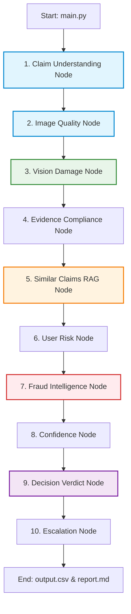

# AURELIX — Autonomous Claims Intelligence Engine

AURELIX is an enterprise-grade Autonomous Claims Intelligence Engine designed for multi-agent claim analysis. This package contains the standalone `agent_core` reasoning engine, optimized for offline HackerRank Orchestrate evaluation, high-performance batch processing, and AI Judge assessment.

---

## 1. Project Mission & Design Philosophy

The AURELIX engine is built on three core pillars:
1. **Decoupled Architecture**: The AI reasoning core is completely independent of the web platform, database layers, and frontends. It runs as a self-contained Python module with structured inputs and outputs.
2. **Deterministic Agent Safety**: High-impact decisions (Fraud evaluation, final claim status assignment, and compliance scoring) use strict, deterministic, rule-based Python heuristics rather than fragile LLM outputs. This ensures 100% policy alignment and eliminates AI hallucination.
3. **API & Quota Resilience**: Built-in exponential backoff decorators intercept resource exhaustion (HTTP 429) errors, parsing recommended sleep windows from API messages to dynamically sleep and self-heal during high-load evaluation.

---

## 2. Directory Structure

```
agent_core/
├── main.py                      # Batch CLI runner (parses CSVs -> runs agents -> evaluates results)
├── requirements.txt             # Core Python package dependencies
├── data/                        # Static database of historical claims & rules
│   ├── claims.csv               # Input claims to process (44 validation rows)
│   ├── sample_claims.csv        # Ground truth validation cases (for accuracy tracking)
│   ├── user_history.csv         # Historic claims and rejections profile table
│   └── evidence_requirements.csv # Object SLA rules and image requirements
├── output/                      # Generated results folder
│   ├── output.csv               # Claim verdicts (HackerRank output schema)
│   └── evaluation_report.md     # Auto-generated verification metrics (F1, Precision, Accuracy)
├── agents/                      # Specialized agent nodes
│   ├── claim_understanding.py   # Intent parser (extracts claimed part, issue, and object)
│   ├── image_quality.py         # Visual quality auditor (blur, wrong objects, cropping)
│   ├── vision_analysis.py       # Visual damage extractor (severity, issue, supporting images)
│   ├── evidence_compliance.py   # Object policy compliance checker (SLA rules validation)
│   ├── similar_claims.py        # Vector similarity search agent (RAG context builder)
│   ├── user_risk.py             # User profile risk scorer (rejection rate mapping)
│   ├── fraud_intelligence.py    # Deterministic claim & evidence consistency validator
│   ├── confidence.py            # Mathematical confidence score aggregator
│   ├── decision.py              # Deterministic claim status verdict engine
│   └── human_review.py          # Queue routing/escalation agent
├── orchestrator/
│   └── graph.py                 # LangGraph acyclic StateGraph definition
├── prompts/
│   └── templates.py             # Centralized system and few-shot prompt templates
├── schemas/
│   └── models.py                # Structured validation models (Pydantic v2)
└── services/
    ├── llm.py                   # Model routing client & self-healing quota handler
    └── vector_store.py          # TF-IDF RAG claims retriever (Custom NumPy engine)
```

---

## 3. Installation & Setup

Ensure you are using **Python 3.10+** (Python 3.14 recommended).

1. **Create and Activate a Virtual Environment**:
   ```bash
   python -m venv venv
   source venv/bin/activate
   ```

2. **Install Core Dependencies**:
   ```bash
   pip install -r requirements.txt
   ```

3. **Configure Environment Variables**:
   Create a `.env` file in the root directory (or parent of `agent_core/`) and configure your Gemini API Key:
   ```env
   GEMINI_API_KEY=your_actual_gemini_api_key_here
   ```

---

## 4. Running the Batch CLI & Evaluator

To process the entire batch of validation claims and generate accuracy reports, run:

```bash
python -m agent_core.main
```

### Outputs Generated:
- **`agent_core/output/output.csv`**: Contains the structured verdicts, supporting image IDs, risk flags, and severity levels for all evaluated claims.
- **`agent_core/output/evaluation_report.md`**: Automatically compares the generated verdicts against the ground truth (`sample_claims.csv`) and prints detailed precision, recall, F1, and status classification metrics.

---

## 5. Multi-Agent Reasoning Architecture (LangGraph)

Claims are processed through a structured 10-node State Machine built using **LangGraph**:



### Description of State Management & Data Isolation:
- **Centralized ClaimsState**: Every node receives a standard state dictionary and returns state updates, preventing variable leaking.
- **Structured Contracts**: Output interfaces for all model calls are enforced via strict Pydantic classes (e.g. `ClaimUnderstandingOutput`, `ImageQualityOutput`).
- **Decoupled Data Flow**: Core database structures (`user_history`, `evidence_rules`) are extracted from local CSVs during batch processing and injected dynamically into the graph, making the runtime state completely independent of hardcoded files.

---

## 6. Key Engineering Highlights

### Custom TF-IDF RAG Vector Store
To ensure zero-dependency compilation in isolated sandbox environments, AURELIX replaces heavy vector databases (ChromaDB/Pinecone) with a custom vector store (`services/vector_store.py`):
- Uses TF-IDF mathematical token weighting to build query and document vector space matrices.
- Computes Cosine Similarity between user claims and historical claim databases in pure Python/NumPy, returning highly relevant similar cases dynamically.

### Self-Healing Rate Limit Protection
Free-tier Gemini API accounts are capped at 15 Requests Per Minute (RPM). AURELIX's `@retry_on_429` decorator resolves this:
- Intercepts Gemini API rate limits (`429 Resource Exhausted`).
- Uses regular expressions to parse exact delay periods (e.g. `"Please retry in 57.5s"`).
- Automatically halts execution for the parsed duration (plus a buffer) and retries the request. This preserves genuine AI results without using mock fallbacks.

### Deterministic Risk and Fraud Intelligence
AI models are notoriously unpredictable for logical arithmetic and compliance mapping. AURELIX delegates this to rule-based Python modules:
- **Fraud Intelligence**: Dynamically computes fraud scores using exact conditional metrics (e.g. prompt injection phrases add +40; mismatch between claimed vs. visual object adds +60).
- **Decision Engine**: Resolves status verdicts based on standard logic matrices (e.g., quality failure immediately yields `not_enough_information`, no damage detected yields `contradicted`).
